# ✅ **Node.js Topic-Wise Interview & Learning Questions**

---

##   Node.js Basics

- [What is Node.js?](#what_is_node_js)

- [What is the V8 engine?](#what_is_the_v8_engine)

- [What is non-blocking I/O?](#what_is_non_blocking_input_output)

- [What is the difference between Node.js and JavaScript (browser)?](#what_is_the_difference_between_node_js_and_javascript_browser)

- [What is the role of libuv in Node.js?](#what_is_the_role_of_libuv_in_node_js)

- [What is event-driven architecture in Node.js?](#what_is_event_driven_architecture)

- [What is thread pool in Node.js?](#what_is_thread_pool)

- [What is I/O Polling Techniques in Node.js?](#what_is_Polling)


##   ES Modules (ESM) in Node.js


* [What is an ES module?](#what_is_an_es_module)

* [What is the difference between CommonJS and ESM?](#what_is_the_difference_between_esm_and_commonjs)

* [What are named exports vs default exports?](#what_are_named_exports_vs_default_exports)

---

##   NPM & Package Management


* [What is `package.json`?](#what_is_package_json)

* [What is `package-lock.json`?](#what_is_package_lock_json)

* [What are dependencies vs devDependencies?](#what_are_dependencies_vs_devdependencies)

* [What is semantic versioning?](#what_is_semantic_versioning)

* [What is a global package?](#what_is_a_global_package)

* [Combined Explanation — npm vs npx (clear + simple) ?](#what_is_npx_npm)


---

##   Node.js Core Modules


* [What is the `fs` module?](#what_is_the_fs_module)

* [What is the difference between sync and async file methods?](#what_is_the_difference_between_sync_and_async_file_methods)

* [What is the `path` module used for?](#what_is_the_path_module_used_for)

* [What is the `http` module used for?](#what_is_the_http_module_used_for)

* [What is the `events` module?](#what_is_the_events_module)

* [What are event emitters?](#what_are_event_emitters)

* [What is the `crypto` module?](#what_is_the_crypto_module_used_for)

---


##   Asynchronous Programming


* [What are callbacks?](#what_are_callbacks)\

* [What is an error-first callback?](#what_is_an_error_first_callback)

* [What are microtasks vs macrotasks?](#what_are_microtasks_vs_macrotasks)

* [What are Promises?](#what_are_promises)

* [What are Promises Chain?](#what_are_promises_Chain)

* [What is async/await?](#what_is_async_await)

---


##   Authentication & Security


* [What is JWT?](#What_is_JWT)

* [What is OAuth?](#What_is_OAuth)

* [What Is Hashing vs Encryption?](#What_Is_Hashing_vs_Encryption)

* [What is salting?](#What_is_salting)

* [What is rate limiting?](#What_is_rate_limiting)

* [What is helmet.js?](#What_is_helmet_js)

* [What is CSRF?](#What_is_CSRF)

* [What is Stateful and Stateless authentication](#What_is_Stateful_and_Stateless_authentication)

---

##   Node.js Streams and Buffers

* [What is a stream?](#What_is_a_stream)

* [What are the four types of streams?](#What_are_the_four_types_of_streams)

* What is a readable stream?
* What is a writable stream?
* What is piping?
* What is backpressure?

* [What is a Buffer?](#What_is_a_Buffer)

* How does Node.js handle binary data?
* How do you create a buffer?

---

##   Process & OS

* [What is `process` in Node.js?](#What_is_process_in_Node)

* [What are environment variables?](#What_are_Environment_Variables)

* [What is `process.env`?](#What_is_process_env)

* [What is `process.nextTick()`?](#What_is_process_nextTick)

* [Difference between nextTick and setImmediate](#process_nextTick_and_setImmediate)

* What is the `os` module?

---


##   Clustering & Scaling

* [What is the cluster module?](#What_is_the_Cluster_Module)

* [What is a worker process and how does it work?](#worker_process_and_how_does_it_work)

* [Why does scaling matter in Node.js?](#Why_does_scaling_matter)

* [What is PM2?](#What_is_PM2)

* What is load balancing?

---


<h1 style="text-align:center;" >Node.js Basics</h1>

---


<h2 id="what_is_node_js" style="color:green; text-align:center;">What is Node.js</h2>

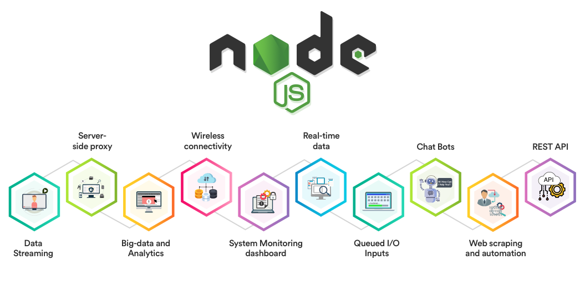

**Node.js is a way to run JavaScript outside the browser.**
Normally, JavaScript runs only inside web browsers (like Chrome, Firefox).
Node.js allows you to run JavaScript directly on your computer or server.

---

###   **A very simple way to remember:**

* **Browser = JavaScript for webpages**
* **Node.js = JavaScript for backend/server**

---

###   **Why is Node.js popular?**

* It is **fast** (uses Google Chrome’s V8 engine).
* It can handle many requests at the same time.
* Great for **APIs**, **real-time apps** (chat, notifications), and **servers**.

---

<hr style="border: 2px solid green;">

<h2 id="what_is_the_v8_engine" style="color:green; text-align:center;">What is the V8 engine?</h2>


**The V8 engine is a program made by Google that runs JavaScript very fast.**

It is used in:

* **Google Chrome browser**
* **Node.js**

---

###   **Why is it important?**

* It converts JavaScript into **machine code** (code the computer understands).
* This makes JavaScript run **very fast and efficiently**.

---

###   **In short:**

**V8 = Fast JavaScript engine created by Google.**


<hr style="border: 2px solid green;">

<h2 id="what_is_non_blocking_input_output" style="color:green; text-align:center;">What is Non-Blocking I/O in Node.js?</h2>

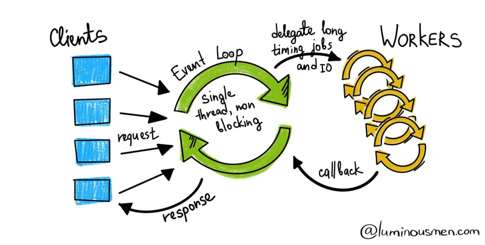


**Non-blocking I/O** means that **Node.js does not wait** for slow operations (like reading a file, querying a database, or making an API call) to finish.

Instead, it:

1. **Starts the I/O operation**
2. **Immediately moves on** to the next line of code
3. When the operation completes, Node.js uses

   * a **callback**,
   * **promise**, or
   * **async/await**
     to return the result.

---

###   🧠 Why is it important?

* It prevents the main thread from **getting stuck** waiting.
* Helps Node.js handle **thousands of requests at the same time**.
* This makes Node.js **fast, scalable, and efficient**, especially for I/O-heavy apps.

---

###   🔌 Example (Simple)

```js
fs.readFile("file.txt", "utf8", (err, data) => {
  console.log(data);
});
console.log("I continue running...");
```

Here:

* File reading happens in the background 🧵
* The main thread continues immediately 🚀

---

###   🗣️ **Short Interview Answer**

**“Non-blocking I/O means Node.js performs input/output operations asynchronously. It doesn't wait for the operation to finish; instead, it uses callbacks, promises, or async/await to handle results. This keeps the main thread free and allows Node.js to handle many requests efficiently.”**


<hr style="border: 2px solid green;">


<h2 id="what_is_the_difference_between_node_js_and_javascript_browser" style="color:green; text-align:center;"> 🔍 Difference Between Node.js and JavaScript (Browser) </h2>

###   🌐 1. **Environment**

* **Browser JavaScript:** Runs inside a web browser (Chrome, Firefox, Safari).
* **Node.js:** Runs **outside the browser** on the server using the **V8 engine**.

---

###   📁 2. **APIs Available**

* **Browser JS:** Has **DOM**, `window`, `document`, `localStorage`, `fetch` (browser version).
* **Node.js:** Has **file system**, **network**, **process**, **streams**, and other backend APIs.

---

###   🧵 3. **Threading Model**

* **Browser JS:** Single-threaded (main thread + Web Workers).
* **Node.js:** Single-threaded for JS but uses **event loop + thread pool** for async tasks.

---

###   📦 4. **Modules**

* **Browser JS:** Uses ES Modules (`import/export`).
* **Node.js:** Supports **CommonJS (`require`)** and **ES Modules**.

---

###   🚀 5. **Use Cases**

* **Browser JS:** User interfaces, web pages, DOM manipulation.
* **Node.js:** Backend development, APIs, real-time apps, CLI tools.

---

###   🗣️ **Short Interview Answer**

**“JavaScript is a programming language, but Node.js is a runtime environment that allows JavaScript to run outside the browser. Browsers provide DOM APIs, while Node.js provides server-side APIs like file system and networking. In short, browser JS is for frontend; Node.js is for backend.”**


<hr style="border: 2px solid green;">

<h2 id="what_is_the_role_of_libuv_in_node_js" style="color:green; text-align:center;"> 🔧 What is the Role of "libuv" in Node.js? </h2>

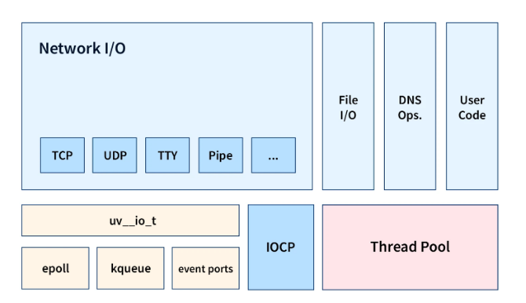

**libuv** is a C library inside Node.js that makes **asynchronous, non-blocking I/O** possible.

It is the **engine behind Node.js’s event loop and thread pool**.

---

###   🧠 libuv Handles 4 Main Things

###   ⏱️ 1. **Event Loop**

* Manages how Node.js runs asynchronous tasks
* Decides *when* callbacks, promises, and async functions execute

###   🧵 2. **Thread Pool**

* Provides background threads for slow tasks like:

  * File system operations
  * DNS lookups
  * Crypto tasks
  * Compression
* Offloads work so the main thread never gets blocked

###   🌐 3. **Cross-Platform Support**

* Makes Node.js run the same on:

  * Windows
  * Linux
  * macOS
* Handles OS-level differences internally

###   🖧 4. **Async I/O Operations**

* Manages networking (TCP/UDP)
* Manages timers (setTimeout / setInterval)
* Manages pipes, streams, handles, file I/O

---

###   🗣️ **Short Interview Answer**

**“libuv is the C library that provides Node.js with an event loop and a thread pool. It enables non-blocking I/O by handling asynchronous operations like file system tasks, network requests, timers, and DNS in the background. This allows Node.js to remain fast and efficient even with a single-threaded JavaScript runtime.”**


<hr style="border: 2px solid green;">

<h2 id="what_is_event_driven_architecture" style="color:green; text-align:center;"> ⚡ What is Event-Driven Architecture in Node.js? </h2>

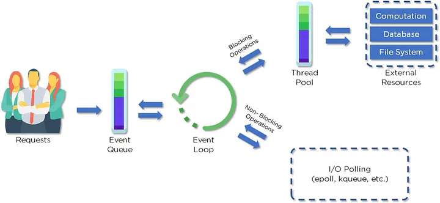


**Event-Driven Architecture (EDA)** is a programming style where your application **reacts to events** instead of following a strict top-to-bottom flow.

Node.js is built heavily on this pattern.

---

###   🔔 How It Works (Simple Explanation)

1. **An event happens**
   (e.g., user clicks, file finishes reading, data received)

2. **Node emits the event**

3. **Your code listens for the event**
   and runs the callback function.

This makes Node.js **fast**, **non-blocking**, and great for handling many requests.

---

###   🧱 Example Flow

* You start reading a file → Node emits a **"start"** event
* File finishes → Node emits a **"done"** event
* If an error occurs → Node emits an **"error"** event

You write listeners for these events.

---

###   🧪 Small Example

```js
const EventEmitter = require('events');
const events = new EventEmitter();

events.on('order', () => {
  console.log("Order received!");
});

events.emit('order');
```

---

###   🎯 Why Node.js Uses Event-Driven Architecture?

* ⚡ Handles many requests at once
* 🧵 No need for multi-threading
* 📬 Everything is queue/event based
* 🚀 Perfect for real-time apps (chat, live updates)

---

###   🛠 Real-Life Examples in Node.js

| Example      | Event Trigger   |
| ------------ | --------------- |
| HTTP server  | "request"       |
| Streams      | "data", "end"   |
| File reading | "open", "close" |
| Timers       | "timeout"       |
| WebSockets   | "message"       |

---

###   🧠 In One Line (Very Simple)

**Node.js works like: Something happens → Node emits an event → Your code reacts.**


<hr style="border: 2px solid green;">

<h2 id="what_is_thread_pool" style="color:green; text-align:center;"> 🧵 What is Thread Pool in Node.js? </h2>

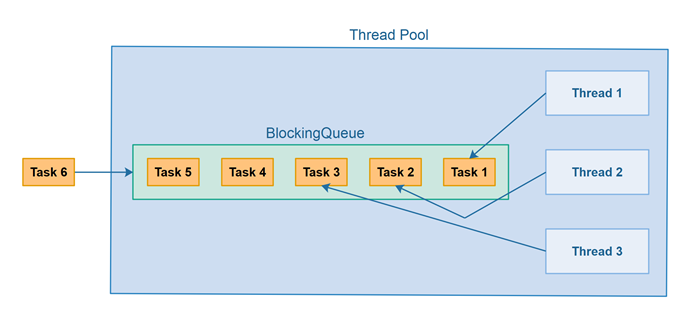

The **Thread Pool** in Node.js is a group of **background worker threads** that handle **heavy or blocking tasks** so the main thread (event loop) stays free.

---

###   ✅ What It Does

When Node.js gets a **slow or CPU-heavy task**, like:

* File system operations
* Compression
* Encryption / hashing
* DNS lookup

➡️ It sends that work to the **Thread Pool** instead of blocking the main thread.

---

###   🔧 Who Provides It?

The Thread Pool is provided by **libuv** (a C library inside Node.js).

Default size: **4 threads**

---

###   🗣️ Simple Interview Answer

**“Thread Pool is a group of background threads in Node.js that handle heavy tasks so the main thread doesn’t get blocked.”**
**“Thread Pool = background workers for heavy tasks.”**


<hr style="border: 2px solid green;">

<h2 id="what_is_Polling" style="color:green; text-align:center;"> 🔍 I/O Polling Techniques in Node.js </h2>

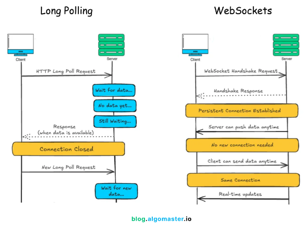


**I/O Polling** is how Node.js **checks the status** of non-blocking tasks
(like file read, DB query, network request).

Node.js asks the system again and again:
👉 “Is the task finished?”
When finished, the event loop runs the callback.

---

### 🧪 **Polling Types (Simple Explanation)**

These are **application-level polling techniques** (used in web apps), not Node.js internals —
but interviewers often ask them together.

###   🕒 **1. Long Polling (Simple)**

Client sends a request →
Server **waits** until new data is available →
Then responds.

If no new data, server holds the request for some time.

**Pros:** Better than short polling
**Cons:** Still creates repeated connections

---

###   🔗 **2. WebSocket (Simple)**

A **continuous, two-way connection** between client and server.

Both sides can send data any time without repeated requests.

**Pros:** Fast, real-time
**Cons:** Slightly more complex to set up

---

### 🗣️ **Super Simple Interview Answer**

**“I/O Polling in Node.js means checking when non-blocking tasks are finished.
Short polling means checking repeatedly.
Long polling means waiting until data is available.
WebSocket creates a constant real-time connection.”**

**“I/O Polling = checking the status of non-blocking I/O tasks.”**


<hr style="border: 2px solid green;">

<h1 style="text-align:center;">ES Modules (ESM) in Node.js</h1>

<h2 id="what_is_an_es_module" style="color:green; text-align:center;">📦 What Is an ES Module (ESM)?</h2>


An **ES Module (ESM)** is the modern JavaScript module system introduced in **ES6 (ECMAScript 2015)**.
It is the official, standard way to import and export code in JavaScript.

Node.js supports ESM using the `.mjs` extension **or** `"type": "module"` in `package.json`.

---

###   🧩 Key Features

* Uses `import` and `export` keywords
* Supports static analysis (better optimization)
* Works in both **browsers** and **Node.js**
* More modern and standardized than CommonJS

---

###   🧪 Example

**export.js**

```js
export const name = "John";
export function greet() {
  console.log("Hello!");
}
```

**import.js**

```js
import { name, greet } from "./export.js";

greet();
```

---

###   🧠 Simple Definition

**ES Modules are the modern JavaScript module system using `import` and `export`. They replace older CommonJS (`require`, `module.exports`).**


<hr style="border: 2px solid green;">

<h2 id="what_is_the_difference_between_esm_and_commonjs" style="color:green; text-align:center;">🔀 What Is the Difference Between CommonJS and ESM  ? </h2>


###   📦 **1. Syntax**

**CommonJS (CJS)**

```js
const fs = require("fs");
module.exports = something;
```

**ESM**

```js
import fs from "fs";
export default something;
```

---

###   ⚙️ **2. Loading Type**

* **CJS:** Loaded **synchronously**
* **ESM:** Loaded **asynchronously**

---

###   🌍 **3. Where They're Used**

* **CJS:** Node.js originally (older system)
* **ESM:** Modern JavaScript (browser + Node.js)

---

###   🔧 **4. Filename Requirements**

* **CJS:** `.js` (default)
* **ESM:** `.mjs` or `"type": "module"` in `package.json`

---

###   🔁 **5. Exports**

* **CJS:** Only one export object

  ```js
  module.exports = { a, b }
  ```

* **ESM:** Named + default exports

  ```js
  export const a = 1;
  export default b;
  ```

---

###   🧠 **6. Top-Level await**

* **CJS:** ❌ Not supported
* **ESM:** ✅ Supported

---

###   ⚡ **7. Performance**

* **CJS:** Faster for small modules
* **ESM:** Better optimization by engines

---

###   🧠 Simple Summary

* **CommonJS = require + module.exports (old system)**
* **ESM = import + export (modern standard)**

Node.js supports **both**, but ESM is the **future**.

<hr style="border: 2px solid green;">

<h2 id="what_are_named_exports_vs_default_exports" style="color:green; text-align:center;">What are named exports vs default exports?</h2>

###   🔹 Named Exports

Export **multiple items by name**.

Example:

```js
export const add = (a, b) => a + b;
export const subtract = (a, b) => a - b;
```

Import:

```js
import { add, subtract } from './math.js';
```

🔑 **Key Points**

* Can export **many things**
* Import names **must match exactly**

---

###   🔸 Default Export

Export **one main value** from a file.

Example:

```js
export default function add(a, b) {
  return a + b;
}
```

Import:

```js
import add from './math.js';
```

🔑 **Key Points**

* Only **one default export** per file
* Import name can be **anything**

---

###   ✅ Quick Summary (Icons)

* 🔹 **Named exports** → many exports, import by exact name
* 🔸 **Default export** → one main export, name is flexible


<hr style="border: 2px solid green;">

<h1 style="text-align:center;">NPM & Package Management</h1>

<h2 id="what_is_package_json" style="color:green; text-align:center;">📦 What is `package.json`?</h2>

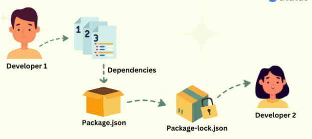


`package.json` is the **main configuration file** for a Node.js project.
It tells Node.js and npm **important info** about your project.

###   📘 What it contains

* 📛 **Project name & version**
* 📚 **List of dependencies** (packages your project needs)
* ⚙️ **Scripts** (commands like start, build, test)
* 🧩 **Metadata** (author, license, description)
* 🔧 **Settings** (like `"type": "module"`)

###   🧠 Simple idea

👉 `package.json` is the **brain of your Node project**—it keeps track of everything your project uses and needs.


<hr style="border: 2px solid green;">

<h2 id="what_is_package_lock_json" style="color:green; text-align:center;">🔒 What is `package-lock.json`?</h2>

`package-lock.json` is a file that **locks the exact versions** of every package (and their sub-packages) installed in your project.

###   📘 What it does

* Ensures **everyone installs the same versions**
* Speeds up installation
* Records the full dependency tree
* Prevents unexpected updates that might break your app

###   🧠 Simple idea

👉 `package-lock.json` makes your project’s dependencies **stable and consistent**, no matter who installs it or when.


<hr style="border: 2px solid green;">

<h2 id="what_are_dependencies_vs_devdependencies" style="color:green; text-align:center;">📦 Dependencies vs ⚙️ DevDependencies</h2>

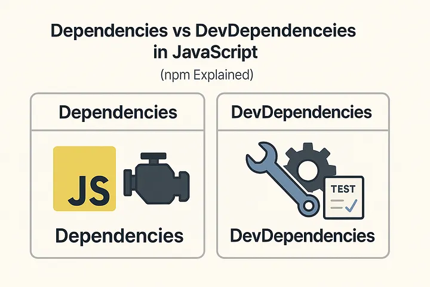


###   📦 Dependencies (`dependencies`)

These are packages your project **needs to run** in production.

Example:

* Express
* Mongoose
* Axios

Installed via:

```bash
npm install express
```

These packages are required when your app is actually running.

---

###   ⚙️ DevDependencies (`devDependencies`)

These are packages used **only during development**, not in production.

Example:

* Nodemon
* ESLint
* Jest (testing)
* Webpack

Installed via:

```bash
npm install --save-dev nodemon
```

They help you build, test, or develop the project but are **not needed by users**.

---

###   🧠 Simple idea

👉 **Dependencies = needed to run the app**
👉 **DevDependencies = needed to build or develop the app, not to run it**


<hr style="border: 2px solid green;">

<h2 id="what_is_semantic_versioning" style="color:green; text-align:center;">What is semantic versioning?</h2>

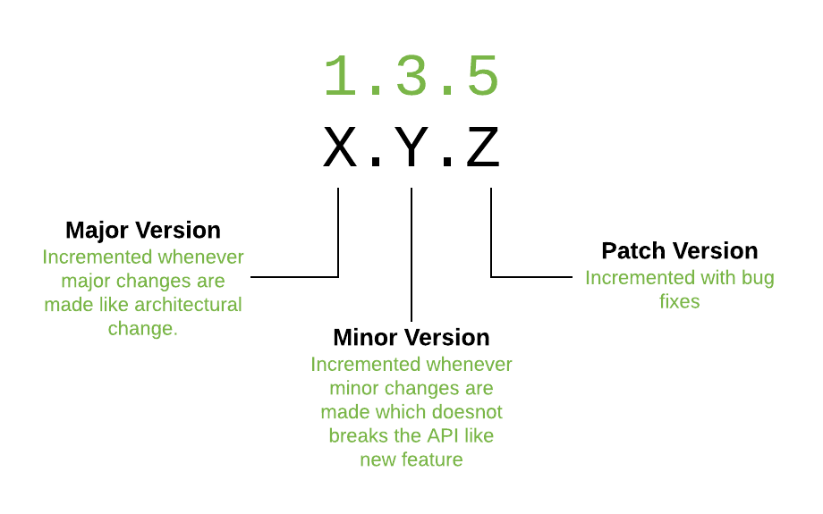

###   🔢 What is Semantic Versioning?

Semantic Versioning (SemVer) is a system for writing version numbers in the format:

###   **📌 MAJOR.MINOR.PATCH**

Example:

```
2.5.3
```

###   🧩 What each number means

* **🔴 MAJOR** — Breaking changes
  (Old code might stop working)

* **🟡 MINOR** — New features added
  (No breaking changes)

* **🟢 PATCH** — Bug fixes
  (No new features, no breaking changes)


<hr style="border: 2px solid green;">

<h2 id="what_is_a_global_package" style="color:green; text-align:center;">🌍 What is a Global Package?</h2>

A **global package** is an npm package that you install **system-wide**, not inside a single project.

Installed with:

```bash
npm install -g packageName
```

###   📌 What it means

* You can use it **from anywhere** in your terminal
* It works like a **system command**

###   🛠 Examples of global packages

* `nodemon`
* `npm` (itself)
* `pm2`
* `eslint` (sometimes)

###   🧠 Simple idea

👉 A global package is like a **tool installed on your whole computer**, not just one project.


<hr style="border: 2px solid green;">

<h2 id="what_is_npx_npm" style="color:green; text-align:center;">⚡ Combined Explanation — npm vs npx (clear + simple)</h2>

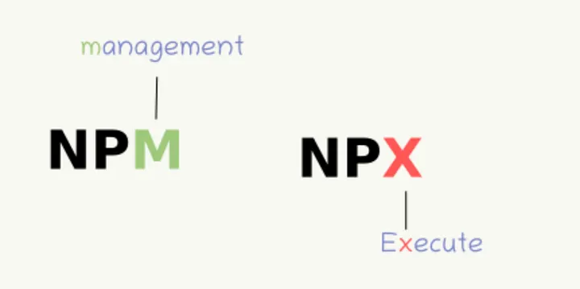


###   📦 **npm (Node Package Manager)**

`npm` is used to **install, manage, or remove** packages in your project.

What it does:

* Installs packages **locally** (`node_modules`)
* Installs packages **globally** (with `-g`)
* Updates or removes packages

Examples:

```bash
npm install express        # install locally
npm install -g nodemon     # install globally
npm uninstall lodash       # remove package
```

🧠 **Think:**
👉 **npm = installs packages** (locally or globally)

---

###   ⚡ **npx (Node Package Execute)**

`npx` is used to **run packages without installing them globally**.

What it does:

* Runs a local package if it already exists
* If not installed, it downloads it **temporarily**, runs it, then deletes it
* Perfect for one-time tools

Examples:

```bash
npx create-react-app myApp
npx nodemon app.js
```

🧠 **Think:**
👉 **npx = runs packages instantly (no install needed)**

---

###   ✅ Final Simple Difference

* **npm** → installs packages
* **npx** → runs packages (without installing them globally)

Let me know if you want examples of when to use each!


<hr style="border: 2px solid green;">

<h1 style="text-align:center;"> Node.js Core Modules</h1>

<h2 id="what_is_the_fs_module" style="color:green; text-align:center;">📁 What is the `fs` Module?</h2>

The `fs` (File System) module in Node.js allows you to **work with files and folders** on your computer.

###   📌 What you can do with `fs`

* 📄 Read files
* ✍️ Write files
* 📂 Create folders
* 🗑 Delete files
* 🔄 Update or rename files
* 👀 Watch file changes

###   🛠 Example

```js
const fs = require('fs');

fs.readFile('test.txt', 'utf8', (err, data) => {
  console.log(data);
});
```

###   🧠 Simple idea

👉 `fs` lets Node.js **interact with your system’s files** just like a file manager.


<hr style="border: 2px solid green;">

<h2 id="what_is_the_difference_between_sync_and_async_file_methods" style="color:green; text-align:center;">🔄 Difference Between Sync and Async File Methods</h2>

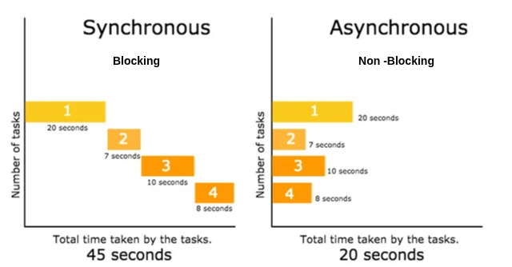

###   ⚡ Async (Asynchronous)

Async methods **do not block** the program.
Node keeps running other code while the file operation happens in the background.

Example:

```js
fs.readFile('a.txt', 'utf8', (err, data) => {
  console.log(data);
});
console.log("I run immediately!");
```

🧠 **Idea:**
👉 Fast, non-blocking, best for servers.

---

###   ⏸ Sync (Synchronous)

Sync methods **block** the program until the operation finishes.
Nothing else can run during that time.

Example:

```js
const data = fs.readFileSync('a.txt', 'utf8');
console.log(data);
console.log("I run after file is done!");
```

🧠 **Idea:**
👉 Slower, blocking, good for small scripts or startup code.

---

###   ✅ Simple Summary

* **Async = non-blocking, recommended for real apps**
* **Sync = blocking, avoid in servers**


<hr style="border: 2px solid green;">

<h2 id="what_is_the_path_module_used_for" style="color:green; text-align:center;">📍 What is the `path` Module Used For?</h2>

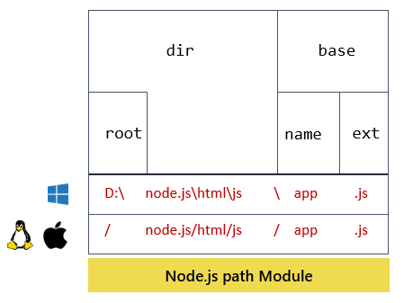


The `path` module helps you **work with file and folder paths** in a safe and consistent way.

###   📌 What it does

* Joins paths
* Resolves absolute paths
* Gets file extensions
* Normalizes messy paths
* Extracts filenames or directory names

###   🛠 Example

```js
const path = require('path');

const fullPath = path.join('folder', 'subfolder', 'file.txt');
console.log(fullPath);
```

###   🧠 Simple idea

👉 The `path` module helps Node.js handle **file paths correctly on all operating systems** (Windows, Mac, Linux).


<hr style="border: 2px solid green;">

<h2 id="what_is_the_http_module_used_for" style="color:green; text-align:center;">What is the `http` module used for?</h2>

The **`http` module** in Node.js is used to **create and manage HTTP servers and clients**. It provides the core functionality required to build web servers without needing any external libraries.

---

###   ✅ **What the `http` module is used for**

###   **1. Creating HTTP Servers**

It allows you to create a web server that listens for requests and sends responses.

```js
const http = require('http');

const server = http.createServer((req, res) => {
  res.write('Hello World');
  res.end();
});

server.listen(3000, () => {
  console.log('Server running on port 3000');
});
```

---

###   **2. Handling HTTP Requests**

You can access:

* `req.url` → request URL
* `req.method` → GET, POST, etc.
* `req.headers` → HTTP headers

---

###   **3. Sending HTTP Responses**

Use methods like:

* `res.writeHead(statusCode, headers)`
* `res.write()`
* `res.end()`

Example:

```js
res.writeHead(200, { "Content-Type": "application/json" });
res.end(JSON.stringify({ message: "OK" }));
```

---

###   **4. Creating HTTP Clients**

You can also make outgoing HTTP requests using `http.request()` or `http.get()`.

Example:

```js
const http = require('http');

http.get('http://example.com', (res) => {
  let data = '';

  res.on('data', chunk => data += chunk);
  res.on('end', () => console.log(data));
});
```

---

###   ✅ **When to use `http` module**

Use it when:

* You want a lightweight web server without frameworks.
* You need low-level control over the request/response process.
* You're building your own framework or a customized microservice.

---

###   ❗ When NOT to use it

For most real-world apps, use frameworks like:

* **Express.js**
* **Fastify**
* **NestJS**

They simplify routing, middleware, body parsing, and more.

<hr style="border: 2px solid green;">

<h2 id="what_is_the_events_module" style="color:green; text-align:center;">What is the `events` module?</h2>

The **`events` module** in Node.js provides the foundation for **event-driven programming**. It lets you create, listen for, and handle custom events in your application.

---

###   ✅ What the `events` module is

It is a **built-in Node.js module** that defines the `EventEmitter` class.
This class lets objects **emit events** and **register listeners** for those events.

Node.js itself uses this pattern internally—streams, HTTP servers, file reads, and many core parts of Node are built on top of `EventEmitter`.

---

###  ✅ Why the `events` module is useful

###  It allows you to:

* Create custom events
* Attach multiple listeners
* Emit events asynchronously or synchronously
* Decouple logic (cleaner architecture)
* Build reactive/observer-style systems

---

###  📌 Basic Example

###  Create an event emitter and listen for an event:

```js
const EventEmitter = require('events');

const emitter = new EventEmitter();

// Listener
emitter.on('greet', (name) => {
  console.log(`Hello, ${name}!`);
});

// Emit event
emitter.emit('greet', 'John');
```

**Output:**

```
Hello, John!
```

---

###  📌 Common Methods

| Method                            | Description                |
| --------------------------------- | -------------------------- |
| `on(event, listener)`             | Attach a listener          |
| `once(event, listener)`           | Listener runs only once    |
| `emit(event, ...args)`            | Trigger an event           |
| `removeListener(event, listener)` | Remove a specific listener |
| `removeAllListeners(event)`       | Remove all listeners       |

---

###  📌 Real Use Cases

###  ✔ Handling server requests

HTTP server emits `request`, `connection`, `close` events.

###  ✔ Streams

Readable/Writable streams use events like `data`, `end`, `error`.

###  ✔ Custom app logic

For example, an event after user registration:

```js
emitter.emit('user_registered', userData);
```

---

###  🧠 Summary (in simple words)

The **`events` module** is like Node.js’s built-in **pub/sub system**.
You emit an event → Code listening for that event runs.


<hr style="border: 2px solid green;">

<h2 id="what_are_event_emitters" style="color:green; text-align:center;">📢 What Are Event Emitters?</h2>


**Event Emitters** are objects in Node.js that can:

1. **Emit (trigger) events**
2. **Listen for events**
3. **Run callback functions when events occur**

They are the core of Node’s **event-driven architecture**.

Node.js provides this through the **`EventEmitter` class** inside the `events` module.

---

###  🔧 How It Works

* You *emit* an event → like saying **“Hey! Something happened!”**
* You *listen* for that event → using `on()` or `once()`
* When the event occurs → the attached function runs

---

###  🧪 Simple Example

```js
const EventEmitter = require('events');

const emitter = new EventEmitter();

emitter.on('greet', () => {
  console.log("Hello!");
});

emitter.emit('greet'); // triggers the event
```

---

###  🔍 Key Methods

| Method                  | Meaning             |
| ----------------------- | ------------------- |
| `on(event, listener)`   | Listen for an event |
| `once(event, listener)` | Listen only once    |
| `emit(event, data)`     | Trigger an event    |
| `removeListener()`      | Remove a listener   |

---

###  🎯 Real Uses of Event Emitters

* HTTP server emits `"request"`
* Streams emit `"data"`, `"end"`
* File system emits `"open"`, `"close"`
* WebSockets emit `"message"`

---

###  🧠 In Simple Words

**Event Emitters let Node.js say: “I’ll call you when something happens.”**


<hr style="border: 2px solid green;">

<h2 id="what_is_the_crypto_module_used_for" style="color:green; text-align:center;">🔐 What Is the `crypto` Module?</h2>

The **`crypto` module** in Node.js is a **built-in security module** used to perform cryptographic operations such as:

* Hashing
* Encryption & decryption
* Generating random values
* Creating HMACs
* Working with keys & certificates

It helps you securely handle passwords, tokens, signatures, and more.

---

###  🧪 Simple Example (Hashing a Password)

```js
const crypto = require('crypto');

const hash = crypto
  .createHash('sha256')
  .update('hello')
  .digest('hex');

console.log(hash);
```

---

###  🔧 Common Things You Can Do with `crypto`

| Feature           | Use                                             |
| ----------------- | ----------------------------------------------- |
| 🔑 Hashing        | Securely store passwords (SHA256, SHA512, etc.) |
| 🧩 HMAC           | Create keyed signatures                         |
| 🎲 Random values  | Generate tokens, OTPs                           |
| 🔐 Encryption     | Encrypt/decrypt data                            |
| 🧵 Key generation | Create public/private keys                      |

---

###  🧠 Simple Definition

**The `crypto` module provides tools to secure your application using encryption, hashing, and cryptographic functions.**


<hr style="border: 2px solid green;">


<hr style="border: 2px solid green;">

<h1 style="text-align:center;" >Asynchronous Programming</h1>

<h2 id="what_are_callbacks" style="color:green; text-align:center;">What are callbacks?</h2>


###  🔁 What Are Callbacks?

A **callback** is a **function passed as an argument to another function**, and it runs **after an asynchronous task completes**.

It’s how Node.js handles async operations like reading files, making requests, or waiting for timers—*without blocking the program*.

---

###  🧪 Simple Example

```js
function greet(name, callback) {
  console.log("Hello " + name);
  callback(); // run after main task
}

greet("John", () => {
  console.log("Callback finished!");
});
```

---

###  📦 Real Node.js Async Example (fs module)

```js
const fs = require('fs');

fs.readFile("file.txt", "utf8", (err, data) => {
  if (err) return console.error(err);
  console.log(data);
});
```

---

###  🎯 Why Callbacks Are Important

* They let Node.js do **non-blocking** operations
* They run **when the async task is done**
* They keep the server fast, even with many requests

---

###  ⚠️ Callback Hell (Common Problem)

Too many nested callbacks:

```js
doA(() => {
  doB(() => {
    doC(() => {
      doD(() => {
        console.log("Too deep!");
      });
    });
  });
});
```

This is why Node.js later introduced **Promises** and **async/await**.

---

###  🧠 Simple Definition

**A callback is a function you give to another function, and it runs later when the async work finishes.**


<hr style="border: 2px solid green;">

<h2 id="what_is_an_error_first_callback" style="color:green; text-align:center;"> ⚠️ What Is an Error-First Callback? </h2>


An **error-first callback** is a **special style** of callback function used in Node.js where:

* The **first argument is always the error** (if any)
* The **second argument is the result**

This pattern helps Node.js easily detect and handle errors in async operations.

---

###  🧪 Example Format

```js
function callback(err, result) {
  if (err) {
    // handle error
  } else {
    // use the result
  }
}
```

---

###  📌 Real Node.js Example (fs.readFile)

```js
const fs = require("fs");

fs.readFile("file.txt", "utf8", (err, data) => {
  if (err) {
    console.error("Something went wrong!");
    return;
  }

  console.log("File content:", data);
});
```

---

###  🎯 Why This Pattern Exists?

* Makes error handling **consistent**
* Easy to detect failure: if `err` is not `null`, something went wrong
* Works perfectly with async operations

---

###  🧠 Simple Definition

**An error-first callback is a callback where the first argument is an error, and the second is the result. If the error exists, you handle it; otherwise, you use the result.**


<hr style="border: 2px solid green;">

<h2 id="what_are_microtasks_vs_macrotasks" style="color:green; text-align:center;">🕒 What Are Microtasks vs Macrotasks?</h2>

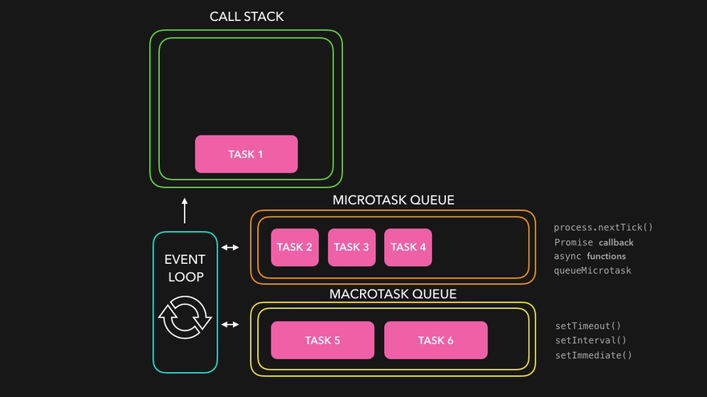


In Node.js (and browsers), asynchronous work is handled by the **event loop**, which uses two main queues:


###  🧩 **Macrotasks (Task Queue)**

Macrotasks are **big async operations** that run *after the current code finishes*.

**Examples of macrotasks:**

* `setTimeout()`
* `setInterval()`
* `setImmediate()`
* I/O callbacks (fs, http)
* `requestAnimationFrame` (browser)

**Runs later** → slower priority.

---

###  ⚡ **Microtasks (Microtask Queue)**

Microtasks are **small, high-priority async tasks** that run **before macrotasks**.

**Examples of microtasks:**

* Promises (`.then`, `.catch`, `.finally`)
* `process.nextTick()` (Node-specific)
* QueueMicrotask

**Runs immediately after current code** → highest priority.

---

###  🎯 Which runs first?

✔ **Microtasks ALWAYS run before macrotasks**
✔ After each macrotask, Node empties the microtask queue

---

###  🧪 Example

```js
console.log("A");

setTimeout(() => console.log("B"), 0);  // macrotask
Promise.resolve().then(() => console.log("C")); // microtask

console.log("D");
```

**Output:**

```
A
D
C  <-- microtask
B  <-- macrotask
```

---

###  🧠 Simple Definition

* **Microtasks = high-priority async tasks (Promises)**
* **Macrotasks = regular async tasks (setTimeout, I/O)**
* **Microtasks run first**


<hr style="border: 2px solid green;">

<h2 id="what_are_promises" style="color:green; text-align:center;">🤝 What Are Promises?</h2>

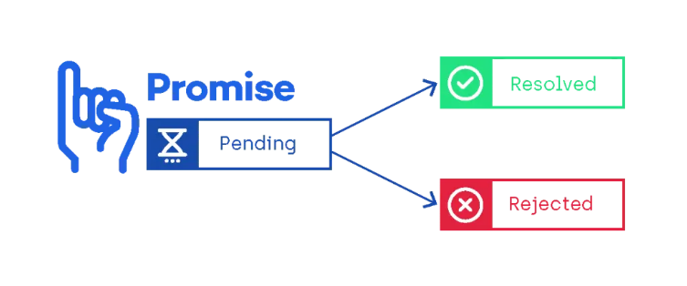


A **Promise** in JavaScript is an object that represents the **eventual result of an asynchronous operation**.
It’s a cleaner alternative to callbacks and helps avoid *callback hell*.

A Promise can be in one of three states:

1. **Pending** → still running
2. **Fulfilled** → completed successfully
3. **Rejected** → failed

---

###  🧪 Simple Example

```js
const myPromise = new Promise((resolve, reject) => {
  const success = true;

  if (success) {
    resolve("Done!");
  } else {
    reject("Error!");
  }
});

myPromise
  .then(result => console.log(result))
  .catch(error => console.log(error));
```

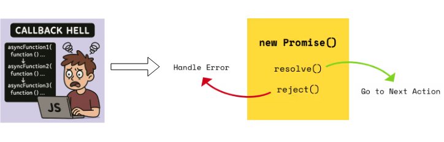

---

###  🎯 Why Promises Are Useful?

* Avoids callback nesting
* Easy error handling
* Chain async operations
* Works with `async/await`

---

###  🧠 Simple Definition

**A Promise is a placeholder for a value that you will get in the future (success or failure).**


<hr style="border: 2px solid green;">

<h2 id="what_are_promises_Chain" style="color:green; text-align:center;">🔗 What Is a Promise Chain?</h2>

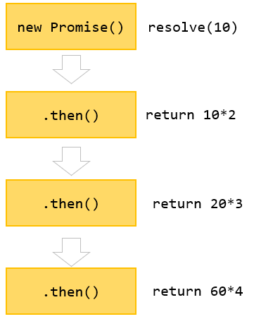


A **Promise chain** is when you connect multiple `.then()` calls one after another so each step runs **after the previous Promise finishes**.

It allows you to run async tasks in sequence **without callback hell**.

---

###  🧩 How It Works

Each `.then()` returns a **new Promise**, so you can keep chaining:

```js
doTask1()
  .then(result1 => doTask2(result1))
  .then(result2 => doTask3(result2))
  .then(result3 => console.log("All done!", result3))
  .catch(error => console.log("Error:", error));
```

---

###  🧪 Simple Example

```js
Promise.resolve(1)
  .then(num => num + 1)     // 2
  .then(num => num * 5)     // 10
  .then(num => console.log(num));
```

**Output:**

```
10
```

---

###  🎯 Why Promise Chaining Is Useful?

* Runs async tasks **step-by-step**
* Avoids nested callbacks
* Makes async code **clean and readable**
* Errors propagate automatically to `.catch()`

---

###  🧠 Simple Definition

**Promise chaining means linking multiple `.then()` calls so each one waits for the previous promise to finish.**


<hr style="border: 2px solid green;">

<h2 id="what_is_async_await" style="color:green; text-align:center;">⏳ What Is async/await?</h2>

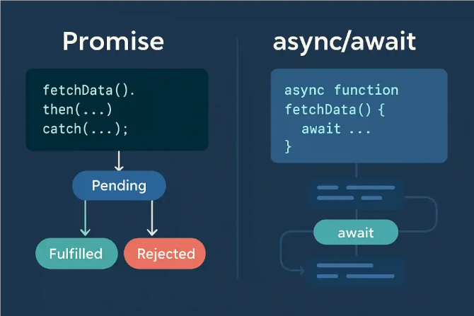


**`async/await`** is modern JavaScript syntax that makes working with Promises look like **simple, synchronous code**—even though it’s still fully asynchronous.

It is built on top of Promises and helps you avoid long `.then()` chains.

---

###  🔧 How It Works

* You mark a function as **`async`**
* Inside it, you use **`await`** to pause the function until a Promise resolves
* The code *looks* synchronous but *runs* asynchronously

---

###  🧪 Simple Example

```js
async function demo() {
  const result = await Promise.resolve("Hello!");
  console.log(result);
}

demo();
```

**Output:**

```
Hello!
```

---

###  📦 Real Example (Fetching Data)

```js
async function getData() {
  try {
    const response = await fetch("https://api.example.com");
    const json = await response.json();
    console.log(json);
  } catch (err) {
    console.error("Error:", err);
  }
}
```

---

###  🎯 Why async/await is great?

* Cleaner and more readable
* Easier error handling using `try...catch`
* No callback hell
* No long Promise chains

---

###  🧠 Simple Definition

**`async/await` lets you write asynchronous code that looks like normal, synchronous code, using Promises behind the scenes.**


<hr style="border: 2px solid green;">

<h1 style="text-align:center;" >Authentication & Security</h1>


<h2 id="What_is_JWT" style="color:green; text-align:center;"> 🔐 What Is JWT? </h2>

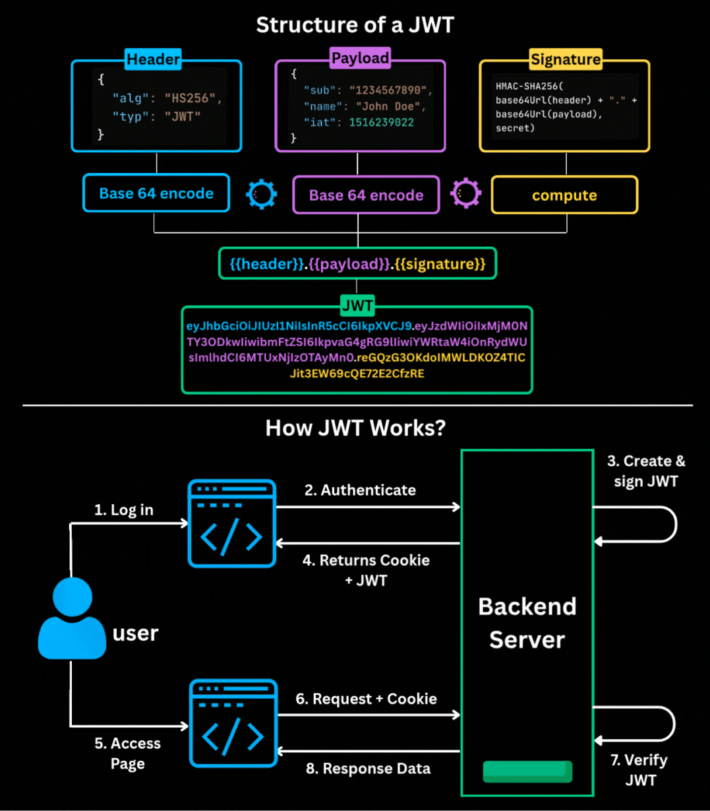

A **JWT (JSON Web Token)** is a **secure, compact token** used for **authentication and data exchange** between a client and server.

It’s commonly used for **login systems**, **API authentication**, and **secure communication**.

---

###  🧩 What a JWT Looks Like

A JWT has **three parts**, separated by dots:

```
header.payload.signature
```

Example:

```
eyJhbGciOiJIUzI1NiIsInR5c... (header)
eyJ1c2VySWQiOjEsInJvbGUiOi... (payload)
SflKxwRJSMeKKF2QT4fwpMeJf36PO... (signature)
```

---

###  📦 JWT Parts Explained

1. **Header**

   * Contains algorithm + type
   * Example: `{ "alg": "HS256", "typ": "JWT" }`

2. **Payload**

   * Contains user data (claims)
   * Example: `{ "id": 1, "role": "admin" }`

3. **Signature**

   * Ensures token **can't be tampered with**
   * Created using a secret key

---

###  🔧 How JWT Works

1. User logs in
2. Server creates a JWT and sends it to client
3. Client stores token (localStorage, cookie, etc.)
4. Client sends token on every request
5. Server verifies the signature
6. If valid → allow access

---

###  🎯 Why JWT Is Popular?

* Stateless → no session storage needed
* Fast for APIs
* Works across domains and platforms
* Easy to pass in headers
* Secure when used with HTTPS

---

###  🧠 Simple Definition

**A JWT is a secure token containing encoded user data, used to verify identity without storing sessions on the server.**


<hr style="border: 2px solid green;">

<h2 id="What_is_OAuth" style="color:green; text-align:center;"> 🔑 What Is OAuth? </h2>

**OAuth** is an **authorization** framework that lets users give one app **permission** to access their data **on another service** — **without sharing their password**.

Think of it as:
**“Login with Google / Facebook / GitHub” safely.”**

---

###  🧩 Simple Example

You want an app to access your Google Drive files.

* You **don’t give your Google password** to that app
* Google shows a **permission screen**
* You click **Allow**
* Google gives the app a **temporary access token**
* The app uses the token (not your password)

---

###  🔧 Key Idea

OAuth provides **secure delegated access** using **tokens**, not passwords.

---

###  📦 Where You See OAuth?

* “Login with Google”
* “Login with GitHub”
* Connecting apps to Dropbox
* Allowing apps to access your Twitter or Facebook data
* Payment apps connecting to banks

---

###  🔐 Why OAuth Is Safe?

* Your password is **never shared**
* Access can be limited (read-only, write, etc.)
* Tokens can expire anytime
* You can revoke access anytime

---

###  🧠 Simple Definition

**OAuth is a secure way to let apps access your data on another service using permission-based tokens instead of passwords.**


<hr style="border: 2px solid green;">

<h2 id="What_Is_Hashing_vs_Encryption" style="color:green; text-align:center;"> 🔐 What Is Hashing vs Encryption? </h2>

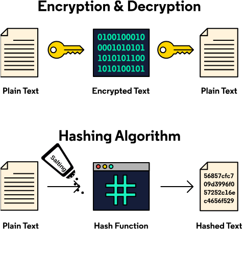

###  🧩 **Hashing (One-Way)**

🔒 **Purpose:** Protect data like passwords
➡️ **One-way only — cannot be reversed**

* Turns data into a fixed-length string
* Same input → same output
* You **cannot get the original value back**
* Used for storing passwords securely

**Example:**
`"password123"` → `ef92b778bafe771e...`

✔ Secure
✔ Fast
✔ Ideal for passwords
❌ Cannot be decrypted

---

###  🔐 **Encryption (Two-Way)**

🔑 **Purpose:** Keep data private
➡️ **Two-way — can be reversed if you have the key**

* Converts data into unreadable cipher text
* Requires a **key** to encrypt and decrypt
* Used for secure communication (HTTPS, tokens, files)

**Example:**
`"hello"` → `EncryptedTextXYZ`
Then using the key → `"hello"` again

✔ Reversible
✔ Used for secure transfers
✔ Needs keys
❗ Lost key = lost data

---

###  🎯 Simple Summary

| Feature                         | Hashing              | Encryption                    |
| ------------------------------- | -------------------- | ----------------------------- |
| Direction                       | One-way              | Two-way                       |
| Can you get original data back? | ❌ No                 | ✅ Yes (with key)              |
| Used for                        | Passwords, checksums | Sensitive data, communication |
| Key required                    | ❌ No                 | ✅ Yes                         |

---

###  🧠 One-Line Definition

**Hashing = one-way protection**
**Encryption = two-way protection with keys**


<hr style="border: 2px solid green;">

<h2 id="What_is_salting" style="color:green; text-align:center;">🧂 What Is Salting? </h2>

**Salting** is a security technique where you add a **random string (salt)** to a password *before hashing it*.
This makes the hash **unique**, even if two users have the same password.

---

###  🧪 Example (Very Simple)

Password:

```
"hello123"
```

Salt:

```
"XyZ9@#"
```

Combined →

```
"hello123XyZ9@#"
```

Then hashed.

---

###  🔒 Why Salting Is Important?

* Prevents attackers from using **precomputed hash tables** (rainbow tables)
* Makes every password hash **unique**
* Even if two users use the same password, their hashes are **different**
* Makes cracking passwords much harder

---

###  🧠 Simple Definition

**Salting adds a random value to a password before hashing to make the hash unique and more secure.**


<hr style="border: 2px solid green;">

<h2 id="What_is_rate_limiting" style="color:green; text-align:center;"> 🚦 What Is Rate Limiting? </h2>

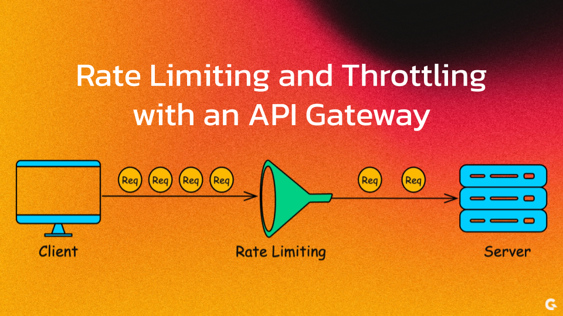


**Rate limiting** is a security technique that **controls how many requests a user (or IP) can make within a specific time**.

It prevents **abuse, spam, brute-force attacks, and server overload**.

---

###  🧪 Simple Example

Allow only **100 requests per minute** per user/IP.

If someone sends the 101st request →
❌ Blocked or delayed.

---

###  🎯 Why Rate Limiting Is Important?

* Stops **brute-force login attempts**
* Protects APIs from **spamming & flooding**
* Prevents **DDoS-like behavior**
* Saves server resources
* Makes your app stable and secure

---

###  🧩 How It Works

A rate limiter tracks:

* IP address
* User ID
* Number of requests
* Time window

If user exceeds the allowed limit → return error:

```
429 Too Many Requests
```

---

###  🔐 Where It's Commonly Used?

* Login routes
* Public APIs
* Contact forms
* Payment systems
* File upload endpoints

---

###  🧠 Simple Definition

**Rate limiting restricts how many requests someone can send in a time period to protect servers from abuse.**


<hr style="border: 2px solid green;">

<h2 id="What_is_helmet_js" style="color:green; text-align:center;"> 🛡️ What Is helmet.js? </h2>


**helmet.js** is an **Express.js security middleware** that helps protect your Node.js applications by setting **various HTTP security headers** automatically.

It makes your app safer with almost zero setup.

---

###  🔧 What Helmet Does

Helmet adds security headers like:

* **Content Security Policy (CSP)** → blocks malicious scripts
* **XSS Protection** → reduces cross-site scripting attacks
* **Hide X-Powered-By** → hides Express/Node info
* **HSTS** → enforces HTTPS
* **NoSniff** → prevents MIME-type sniffing
* **Frameguard** → stops clickjacking

---

###  🧪 Simple Example

```js
const express = require("express");
const helmet = require("helmet");

const app = express();
app.use(helmet());

app.listen(3000);
```

Just one line: `app.use(helmet())` → your app gets multiple security layers.

---

###  🎯 Why Use helmet.js?

* Protects your API from common web vulnerabilities
* Requires almost **no configuration**
* Recommended for production apps
* Works perfectly with Express.js

---

###  🧠 Simple Definition

**helmet.js is a security middleware for Express that adds important HTTP headers to protect your app from attacks like XSS, clickjacking, and code injection.**


<hr style="border: 2px solid green;">

<h2 id="What_is_CSRF" style="color:green; text-align:center;"> What is CSRF (Cross-Site Request Forgery) </h2>

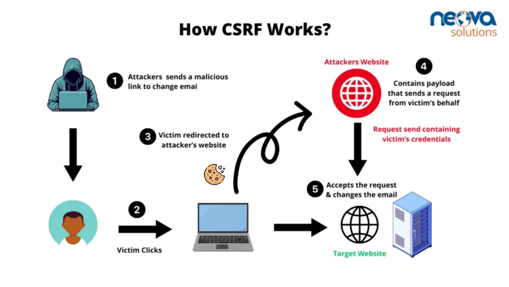


###  **Simple Explanation**

CSRF happens when a **bad website tricks your browser into performing an action on another website where you’re already logged in** — without you knowing.

###  **Simple Example**

You're logged in to your bank.
You open an evil website in another tab.
That website secretly sends a request:

```
POST https://yourbank.com/transfer?amount=5000&to=attacker
```

Your browser includes your **bank cookies**, so the bank thinks *you* requested it.

---

###  **Technical Explanation**

CSRF exploits the fact that:

* Browsers **automatically send cookies** (session cookies, auth cookies) with every request.
* If the attacker can make your browser **send a request** (form submit, image load, script, fetch), the server cannot tell it wasn’t you.

###  **Attack Example (HTML Form)**

```html
<form action="https://bank.com/transfer" method="POST" style="display:none">
  <input type="hidden" name="amount" value="5000">
  <input type="hidden" name="to" value="attacker">
</form>
<script>
  document.forms[0].submit();
</script>
```

If you're logged into the bank in the same browser, the request works.

---

###  **Protection**

###  1. **CSRF Tokens**

Server generates a random token and adds it to forms:

```html
<input type="hidden" name="csrf_token" value="93hf83hf83h">
```

Server verifies the token → attacker cannot guess it.

###  2. **SameSite Cookies**

Set cookies so they **aren’t sent** on cross-site requests:

```
Set-Cookie: session=abc123; SameSite=Strict;
```

###  3. **Double Submit Cookie**

Send token in both **cookie + body/header** → must match.


<hr style="border: 2px solid green;">

<h2 id="What_is_Stateful_and_Stateless_authentication" style="color:green; text-align:center;"> *Stateful Authentication and Stateless Authentication  </h2>

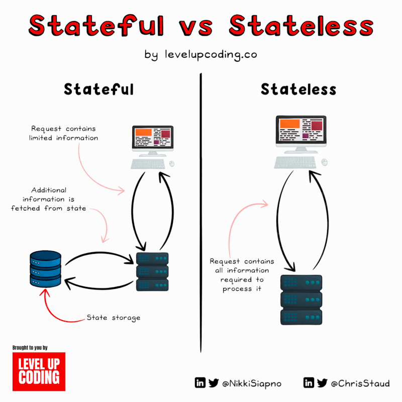

###  ✅ **Stateful Authentication (Session-based) — CORRECT VERSION**

**Flow:**

1. **User sends email + password**
2. **Server checks credentials**
3. If correct → **Server creates a session** (stores it in memory, Redis, or DB)
4. Server sends back a **session ID in a cookie**
5. On the next request → client sends the **cookie**
6. Server **compares the session ID** with the saved session
7. If matches → server returns the response

**Key point:**
✔️ Server **stores session data**
✔️ Server **validates each request by checking stored session**

This is **stateful** because the server keeps "state".

---

###  ✅ **Stateless Authentication (JWT token) — CORRECT VERSION**

**Flow:**

1. **User sends email + password**
2. **Server checks credentials**
3. If correct → **Server creates a JWT token**
4. Server sends JWT token to the client
5. Client stores token (cookie or localStorage)
6. Next request → client sends **Authorization: Bearer JWT** header
7. Server **verifies token signature** (no DB lookup needed)
8. If valid → server returns the response

**Key point:**
✔️ Server does **not store the token**
✔️ Token is **self-contained** (payload + signature)

This is **stateless** because the server keeps **no session state**.

---

###  🎯 Summary Table

| Feature                           | Stateful (Session)     | Stateless (JWT)             |
| --------------------------------- | ---------------------- | --------------------------- |
| Server stores data?               | ✔️ Yes (session store) | ❌ No                        |
| Authentication data stored where? | Server                 | JWT token itself            |
| Client sends?                     | Session cookie         | JWT in header/cookie        |
| Performance                       | Slower at scale        | Faster at scale             |
| Logout?                           | Easy (delete session)  | Hard (need token blacklist) |


<hr style="border: 2px solid green;">


<h1 style="text-align:center;" >Node.js Streams and Buffers</h1>

<h2 id="UNIQE_IDENDIFATION" style="color:green; text-align:center;"> 🌊 What is a Stream in Node.js? </h2>


###  🌊 **What is a Stream in Node.js?**

A **stream** is a feature in Node.js that lets you **process data in small chunks** instead of loading the whole data into memory at once.

###  🧒 Simple Explanation

Imagine watching a YouTube video —
you don’t download the entire video first.
You receive it **bit by bit** and play it immediately.
That’s exactly how streams work.

###  🧠 Technical Explanation

A stream is an **EventEmitter** that handles **continuous data flow**.
It lets you **read** or **write** data chunk-by-chunk, improving performance and memory usage.

###  ⭐ Why Use Streams?

* Efficient with **large files** (videos, logs)
* Uses **less memory**
* Faster processing
* Non-blocking

###  📘 Example

Reading a file using a stream:

```js
const fs = require('fs');

const stream = fs.createReadStream('big.txt');

stream.on('data', chunk => {
  console.log("Chunk received:", chunk.toString());
});
```


<hr style="border: 2px solid green;">

<h2 id="What_are_the_four_types_of_streams" style="color:green; text-align:center;"> 🛠️ What Are the Four Types of Streams in Node.js? </h2>

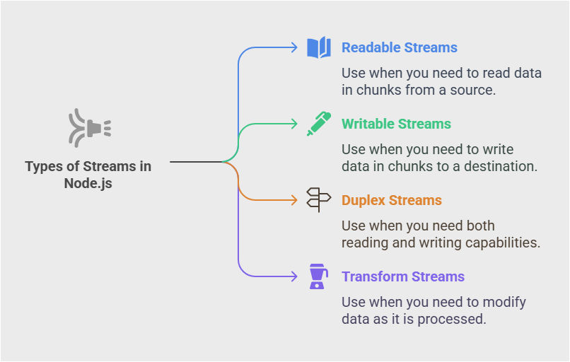

###  1️⃣ **Readable Stream**

📥 *Data comes **into** your program.*
Used to **read** data chunk-by-chunk.

**Examples:**

* `fs.createReadStream()`
* HTTP request body (`req` in Express)

---

###  2️⃣ **Writable Stream**

📤 *Data goes **out** of your program.*
Used to **write** data chunk-by-chunk.

**Examples:**

* `fs.createWriteStream()`
* HTTP response (`res` in Express)

---

###  3️⃣ **Duplex Stream**

🔁 *Can both read and write independently.*
Acts like **two separate channels** in one.

**Examples:**

* TCP sockets
* Net streams

---

###  4️⃣ **Transform Stream**

🔄 *Can read and write**, and also **modify** data as it flows.*
Think of it as a “filter” or “processor”.

**Examples:**

* `zlib.createGzip()` (compress data)
* `crypto.createCipher()` (encrypt data)

---

###  🧠 Quick Summary Table

| Type      | Can Read? | Can Write? | Can Transform? |
| --------- | --------- | ---------- | -------------- |
| Readable  | ✔         | ✖          | ✖              |
| Writable  | ✖         | ✔          | ✖              |
| Duplex    | ✔         | ✔          | ✖              |
| Transform | ✔         | ✔          | ✔              |

---


<hr style="border: 2px solid green;">

<h2 id="What_is_a_Buffer" style="color:green; text-align:center;"> What is a Buffer? </h2>


📦 A **Buffer** in Node.js is a special memory container used to store **raw binary data** (bytes).
Node.js uses Buffers to handle data that is **not text**, like files, images, videos, network packets, etc.

---

###  🔍 **Simple Explanation**

A Buffer is like a **box full of bytes**.
Each byte is a number (0–255).

Example: reading an image → you get binary data → stored in a Buffer.

---

###  🧪 **Technical Explanation**

Buffers are used when dealing with:

* `fs` file operations
* network requests (`net`, `http`)
* stream processing
* converting binary ↔ text

Node.js allocates Buffers from its own memory space (outside V8 engine).

<hr style="border: 2px solid green;">


<h1 style="text-align:center;" >Process & OS</h1>

<h2 id="What_is_process_in_Node" style="color:green; text-align:center;"> ⚙️ What is `process` in Node.js?** </h2>

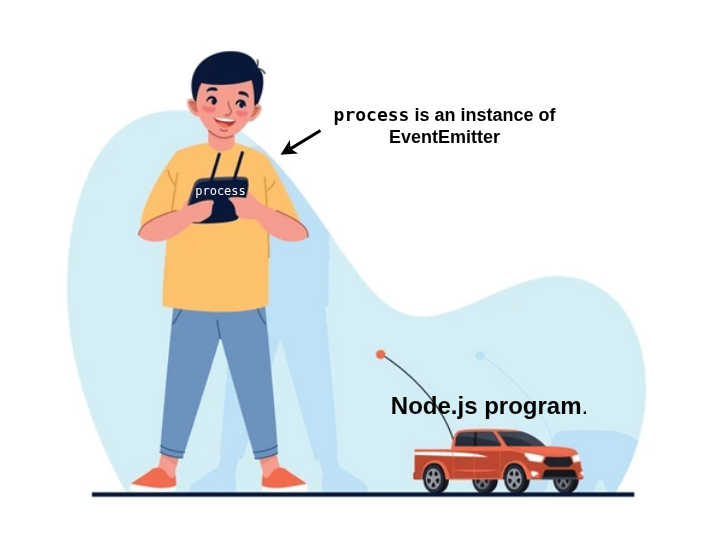


The **`process`** object is a built-in Node.js object that gives you information and control over the **current running Node.js program**.

Think of it as the “remote control” for your Node.js app.

---

###  🧩 **Simple Explanation**

`process` tells you:

* where your app is running
* what arguments were passed
* what the environment variables are
* when your app should exit
* CPU & memory usage

---

###  🧪 **Technical Explanation**

`process` is an instance of **EventEmitter** and provides access to:

* `process.env` → environment variables
* `process.argv` → command-line arguments
* `process.pid` → process ID
* `process.cwd()` → current directory
* `process.exit()` → stop the app
* `process.memoryUsage()` → RAM details
* `process.uptime()` → how long app is running

---

###  🧰 **Example**

```js
console.log(process.pid);       // process ID
console.log(process.argv);      // command line args
console.log(process.env.NODE_ENV); // env variable
```

---

###  🎯 **When is it used?**

* Reading environment variables (`process.env.DB_PASS`)
* Checking command-line tools (`process.argv`)
* Exiting program safely (`process.exit()`)
* Logging system info (memory/CPU)
* Gracefully shutting down servers


<hr style="border: 2px solid green;">

<h2 id="What_are_Environment_Variables" style="color:green; text-align:center;"> 🌍 What are Environment Variables? </h2>

Environment variables are **key–value settings** stored **outside your code** that your application can read at runtime.

They are used to store **configuration** such as:

* database passwords
* API keys
* port numbers
* environment mode (`development`, `production`)

---

###  🧩 **Simple Explanation**

Think of environment variables as **secret settings** that the server gives to your app.

You **don’t write them in code** → you load them from the system.

---

###  🧪 **Technical Explanation**

Environment variables live inside the OS and are accessed in Node.js using:

```js
process.env
```

Example:

```bash
export DB_PASSWORD=123456
```

Then in Node.js:

```js
console.log(process.env.DB_PASSWORD);
```

---

###  🧰 **Common Use Examples**

###  **1. Setting PORT**

```bash
export PORT=3000
```

```js
console.log(process.env.PORT); // 3000
```

###  **2. Hiding API Keys**

```bash
export API_KEY=abcdefg
```

```js
console.log(process.env.API_KEY);
```

###  **3. Using `.env` file with dotenv**

`.env`

```
JWT_SECRET=mysecretkey
```

Code:

```js
require('dotenv').config();
console.log(process.env.JWT_SECRET);
```

---

###  🎯 **Why use environment variables?**

* Keep passwords OUT of source code
* Different settings for dev / test / production
* Easy to configure on servers
* Improve security


<hr style="border: 2px solid green;">

<h2 id="What_is_process_env" style="color:green; text-align:center;">  🌿 What is `process.env`?</h2>

`process.env` is a **special object in Node.js** that lets you access all **environment variables** of your system.

Think of it as a **bag of configuration values** (API keys, passwords, ports) available to your app.

---

###  🔍 **Simple Explanation**

`process.env` = **all environment variables your app can read**.

Example:
If you set:

```
PORT=4000
```

You can read it in Node.js:

```js
console.log(process.env.PORT); // 4000
```

---

###  🧪 **Technical Explanation**

* `process` = Node’s current running program
* `env` = environment (variables provided by OS)
* `process.env` is just a **JavaScript object**

It contains values like:

```js
{
  PATH: "/usr/bin:/bin",
  HOME: "/home/user",
  NODE_ENV: "production",
  PORT: "3000"
}
```

---

###  🧰 **Common Uses**

###  ✔ 1. App Mode (dev/prod)

```js
if (process.env.NODE_ENV === "production") {
  console.log("Running in production mode");
}
```

###  ✔ 2. Secrets (passwords, keys)

```js
console.log(process.env.DB_PASSWORD);
```

###  ✔ 3. Port number

```js
const PORT = process.env.PORT || 3000;
```

---

###  🎯 **Why it's important**

* Keeps secrets out of your code
* Allows different configurations for different environments
* Works in all cloud servers (AWS, Vercel, DigitalOcean)


<hr style="border: 2px solid green;">

<h2 id="What_is_process_nextTick" style="color:green; text-align:center;"> ⚡ What is `process.nextTick()`? </h2>


`process.nextTick()` is a Node.js function that lets you run a callback **immediately after the current operation**, *before* the event loop continues.

It schedules a function to run **at the end of the current phase** — *before any timers, promises, or I/O callbacks*.

---

###  🌱 **Simple Explanation**

`process.nextTick()` means:

👉 “Run this function **right after the current line is done**, before anything else happens.”

It’s like saying:
**"Do this as soon as possible, before moving forward."**

---

###  🧪 **Technical Explanation**

* It adds the callback to the **microtask queue** (like a special priority list).
* It runs **before**:

  * `setTimeout`
  * `setImmediate`
  * I/O callbacks
  * Promises (in practice, `nextTick` runs even before promise microtasks)

Because of this, it has **higher priority**.

---

###  🧰 **Example**

```js
console.log("Start");

process.nextTick(() => {
  console.log("Next Tick");
});

console.log("End");
```

**Output:**

```
Start
End
Next Tick
```

`nextTick` runs **after the current code finishes**, but **before** the event loop continues.

---

###  🎯 **When to use `process.nextTick()`**

* When you need to **finish something immediately** before the event loop continues
* When you must run code **after the current function but before anything else**

Examples:

* Initialize something before the app runs I/O
* Ensure callbacks run predictably
* Avoid breaking synchronous flow when switching to async

---

###  ⚠️ **Warning**

Avoid using too many `nextTick()` calls because it can block the event loop (infinite loop risk).


<hr style="border: 2px solid green;">

<h2 id="process_nextTick_and_setImmediate" style="color:green; text-align:center;"> ⚡ Difference Between `process.nextTick()` and `setImmediate()` </h2>

Here is the simplest, clearest explanation:

---

###  🔹 **`process.nextTick()`**

🟢 Runs **immediately after the current code finishes**
🟢 Runs **before** the event loop continues
🟢 Has **higher priority** than everything (even Promises)

**When it runs:**
👉 *Before timers, before I/O callbacks, before setImmediate*

**Example:**

```js
console.log("A");

process.nextTick(() => console.log("nextTick"));

console.log("B");
```

**Output:**

```
A
B
nextTick
```

---

###  🔹 **`setImmediate()`**

🔵 Runs **at the end of the current event loop cycle**
🔵 Runs **after I/O events are done**
🔵 Lower priority than nextTick

**When it runs:**
👉 *On the next iteration of the event loop*

**Example:**

```js
console.log("A");

setImmediate(() => console.log("immediate"));

console.log("B");
```

**Output:**

```
A
B
immediate
```

---

###  ⭐ **Side-by-Side Comparison**

| Feature                        | `process.nextTick()`         | `setImmediate()`         |
| ------------------------------ | ---------------------------- | ------------------------ |
| Priority                       | Higher                       | Lower                    |
| Runs                           | Before event loop continues  | On next event loop cycle |
| Executes before timers?        | ✔ Yes                        | ✖ No                     |
| Executes before I/O callbacks? | ✔ Yes                        | ✖ No                     |
| Good for                       | Quick, urgent microtasks     | Running after I/O events |
| Danger                         | Too many → blocks event loop | Safe                     |

---

###  🎯 **Super Simple Comparison**

* **nextTick** → *Run ASAP, before anything else.*
* **setImmediate** → *Run soon, but after the current event loop cycle.*

---

###  🧘 **Simple Example to See Order**

```js
process.nextTick(() => console.log("1 nextTick"));

setImmediate(() => console.log("2 immediate"));

console.log("3 normal code");
```

**Output always:**

```
3 normal code
1 nextTick
2 immediate
```


<hr style="border: 2px solid green;">

<h1 style="text-align:center;" >Clustering & Scaling</h1>

<h2 id="What_is_the_Cluster_Module" style="color:green; text-align:center;"> 🧩 **What is the Cluster Module? </h2>

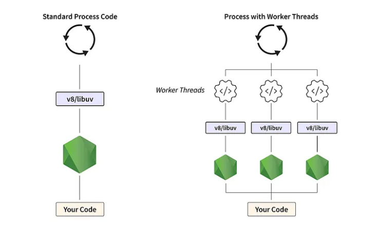


The **cluster module** in Node.js allows you to create **multiple Node.js processes** (workers) that all share the **same server port**, so your app can use **all CPU cores** instead of just one.

---

###  🌱 **Simple Explanation**

Node.js runs on **a single CPU core** by default.
If your server has **8 CPU cores**, Node.js still uses only **one**.

The **cluster module** lets you start **one master + many worker processes** so your app can handle more load.

👉 *Think of it like creating 8 copies of your server to handle more users.*

---

###  ⚙️ **Technical Explanation**

* The **master process** creates worker processes
* Each worker runs the SAME server code
* All workers share the same port (e.g., 3000)
* When a request comes, OS load-balances between workers
* If a worker crashes, the master can restart it

---

###  🧰 **Basic Example**

```js
const cluster = require('cluster');
const http = require('http');
const os = require('os');

if (cluster.isMaster) {
  const cpus = os.cpus().length;

  console.log(`Master starting ${cpus} workers`);

  for (let i = 0; i < cpus; i++) {
    cluster.fork(); // Create worker
  }
} else {
  http.createServer((req, res) => {
    res.end(`Handled by worker ${process.pid}`);
  }).listen(3000);

  console.log(`Worker ${process.pid} started`);
}
```

---

###  🚀 **Why use Cluster?**

* Make use of ALL CPU cores
* Handle more traffic
* Improve server performance
* Auto-restart workers if they die
* Zero downtime with rolling updates

---

###  🎯 **Real Use Cases**

* High-traffic APIs
* Chat applications
* E-commerce sites
* Background job processors


<hr style="border: 2px solid green;">

<h2 id="worker_process_and_how_does_it_work" style="color:green; text-align:center;"> 👷 What Is a Worker Process in Node.js? </h2>

A **worker process** is a **separate Node.js process** created to do work in parallel with other processes.
Node.js is single-threaded, so workers help you **use all CPU cores** and **handle more requests simultaneously**.

---

###  🌱 **Simple Explanation**

Think of your server as a restaurant:

* **Master process = Manager**
* **Worker processes = Chefs**

The manager (master) doesn’t cook; it only **creates and supervises** chefs.
Each chef (worker) cooks food **independently**, so the restaurant serves more customers at the same time.

---

###  ⚙️ **Technical Explanation**

A **worker process** is created using the `cluster` module:

* Each worker is a **full Node.js process**
* Each worker runs the **same code**
* All workers share the **same server port**
* OS load-balances requests between workers
* Workers restart automatically if they crash (if you configure it)

Example:

```js
const cluster = require('cluster');
const http = require('http');
const os = require('os');

if (cluster.isMaster) {
  const cpuCount = os.cpus().length;

  // Create workers
  for (let i = 0; i < cpuCount; i++) {
    cluster.fork();
  }
} else {
  // Worker server code
  http.createServer((req, res) => {
    res.end(`Handled by worker ${process.pid}`);
  }).listen(3000);
}
```

---

###  🔄 **How Worker Processes Work**

###  **1. Master process starts**

* Checks number of CPU cores
* Creates a worker for each core

###  **2. Workers start running code**

* Each worker runs the server
* All listen on the same port (e.g., 3000)

###  **3. Incoming requests**

* OS decides: “Which worker should handle this request?”
* It gives requests to workers in a round-robin or OS-level scheduling

###  **4. If a worker crashes**

* Master detects it
* Master can automatically spawn a NEW worker

---

###  🎯 **Why Worker Processes Are Useful**

* Handle **more users** at the same time
* Improve **performance**
* Spread load across **multiple CPU cores**
* Increase **fault tolerance**
* Enable **zero-downtime restarts**

---

###  🧠 **Short Summary**

| Role              | Description                                 |
| ----------------- | ------------------------------------------- |
| **Master**        | Creates, manages, restarts workers          |
| **Worker**        | Runs the actual server and handles requests |
| **Workers count** | Usually equal to number of CPU cores        |
| **Port**          | All workers share the same port             |


<hr style="border: 2px solid green;">

<h2 id="Why_does_scaling_matter" style="color:green; text-align:center;"> 📈 Why Does Scaling Matter in Node.js? </h2>

Scaling matters because it allows your Node.js application to handle **more users**, **more requests**, and **more workload** without slowing down or crashing.

---

###  🌱 **Simple Explanation**

Imagine your shop has only **one cashier**.
If 100 customers come in, the line becomes huge.

Scaling = **adding more cashiers** so customers are served faster.

Node.js by default uses **only one CPU core** → like one cashier.
Scaling lets you use **all CPU cores** → more cashiers → more speed.

---

###  ⚙️ **Technical Reason**

Node.js runs JavaScript on **a single thread**, meaning:

* One request at a time (per process)
* Heavy CPU tasks can block other requests
* Only **one CPU core** is used out of many

###  Scaling solves this by:

* Creating **multiple worker processes**
* Distributing incoming requests across workers
* Allowing **parallel processing**
* Avoiding single-thread bottleneck

---

###  🚀 **Benefits of Scaling**

###  **1. More Requests per Second**

More workers → more traffic handling.

###  **2. Faster Response Times**

The server doesn't get overloaded.

###  **3. Prevents Crashes**

If one worker crashes, others continue working.

###  **4. Uses Full Hardware**

If your server has 8 cores, Node.js can use all 8.

###  **5. Better User Experience**

No slowdowns, no timeouts.

---

###  🔧 **How Scaling Happens in Node.js**

###  **1. Using Cluster Module**

Creates multiple worker processes:

```js
cluster.fork();
```

###  **2. Using PM2 (recommended)**

PM2 handles:

* Clustering
* Restarting crashed workers
* Load balancing

```bash
pm2 start app.js -i max
```

###  **3. Horizontal Scaling**

Add more servers behind a load balancer.

###  **4. Auto-scaling (Cloud)**

AWS, Google Cloud automatically add/remove servers.

---

###  🧠 **Short Summary**

| Need               | Reason                           |
| ------------------ | -------------------------------- |
| Handle more users  | Prevent server overload          |
| Use all CPU cores  | Node.js is single-threaded       |
| Faster app         | Reduce delay during high traffic |
| High availability  | If one process fails, others run |
| Better performance | Parallel execution of tasks      |


<hr style="border: 2px solid green;">

<h2 id="What_is_PM2" style="color:green; text-align:center;"> What is PM2? </h2>


**PM2 (Process Manager 2)** is a **production process manager** for Node.js applications.
It keeps your app **running forever**, helps with **auto-restart**, **load balancing**, **logs**, and **monitoring**—all with simple commands.

---

###  **Why do developers use PM2?**

PM2 helps solve real-world production issues:

###  🔥 **1. Auto-Restart on Crash**

If your Node app crashes, PM2 automatically restarts it.

###  🔄 **2. Auto-Restart on Code Changes**

Using **pm2 reload / watch** mode, your app restarts when files change.

###  ⚖️ **3. Load Balancing (Cluster Mode)**

PM2 can start multiple Node processes using all CPU cores:

```sh
pm2 start app.js -i max
```

###  📜 **4. Log Management**

PM2 stores **stdout**, **stderr**, and **error logs** in organized files.

###  📈 **5. Monitoring Dashboard**

PM2 provides CPU, memory usage, uptime:

```sh
pm2 monit
```

###  🚀 **6. Startup Scripts**

PM2 can generate scripts to start your app when the server boots:

```sh
pm2 startup
```

---

###  **Simple Definition**

> **PM2 is a tool that keeps your Node.js apps alive, scalable, and easy to manage in production.**

---

###  **Small PM2 Example**

###  Start app:

```sh
pm2 start server.js
```

###  Restart:

```sh
pm2 restart server.js
```

###  Cluster mode:

```sh
pm2 start server.js -i max
```

###  View logs:

```sh
pm2 logs
```

<hr style="border: 2px solid green;">
